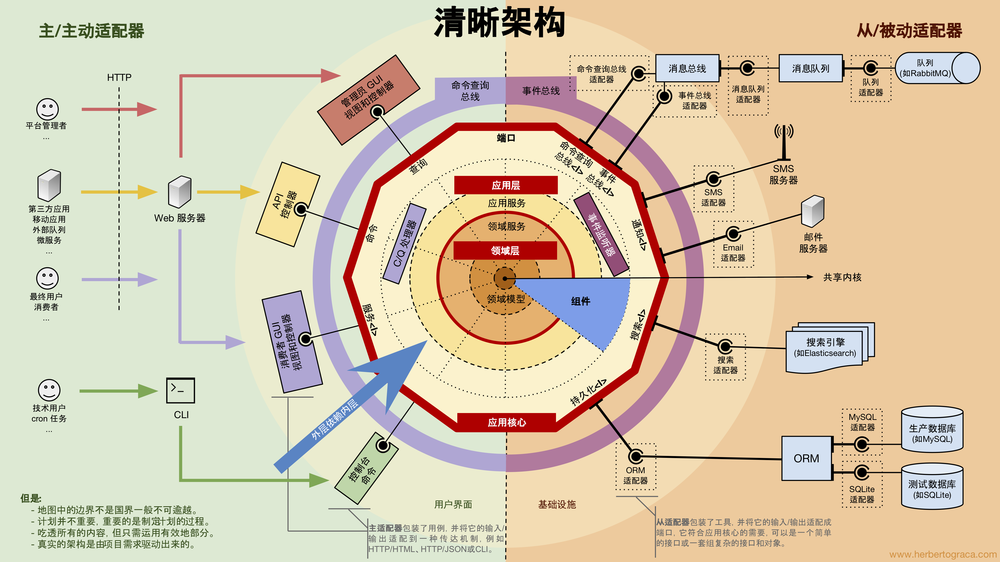

<p align="center">
    
    
</p>

<p align="center">
    <a href="https://github.com/ixugo/goddd/releases"></a>
    <a href="https://github.com/ixugo/goddd/blob/master/LICENSE.txt"></a>
	<a href="https://gin-gonic.com"></a>
    <a href="https://gorm.io"></a>
</p>

<p align="center">
    <a href="./README.md">English</a> | <a href="./README_CN.md">中文</a>
</p>

# GoDDD —— Go 语言领域驱动设计框架

**GoDDD** = **Go** + **DDD**（Domain-Driven Design，领域驱动设计）

一个基于清晰架构（Clean Architecture）思想，专为 Go 语言中小型项目设计的 REST API 框架与代码生成工具。

---

## 🎯 设计哲学

### 清晰架构的 Go 实践

GoDDD 深受 [清晰架构（Clean Architecture）](https://blog.cleancoder.com/uncle-bob/2012/08/13/the-clean-architecture.html) 的启发。我们在理解其核心原则后，针对中小型项目的实际情况，设计出一套**务实的分层架构**——既保留了依赖倒置的核心价值，又避免了过度抽象带来的开发负担。

<p align="center">
    
</p>

### 核心原则

**依赖规则**：外层依赖内层，内层通过接口反转依赖外部。

```
┌─────────────────────────────────────────────────────────────────────┐
│                         API 层 (主动适配器)                          │
│  internal/web/api/                                                  │
│  职责: HTTP 协议转换 → 调用 Core → 返回响应                          │
└────────────────────────────────┬────────────────────────────────────┘
                                 │ 依赖
                                 ▼
┌─────────────────────────────────────────────────────────────────────┐
│                     Core 层 (领域层/业务核心)                        │
│  internal/core/<domain>/                                            │
│  职责: 业务逻辑、领域模型、定义端口接口                               │
│                                                                     │
│  ├─ core.go           # Core 结构体 + Storer 接口定义                │
│  ├─ port.go           # 被动适配器接口 (跨领域协作)                   │
│  ├─ model.go          # 领域内类型定义 (非 GORM 映射)                 │
│  ├─ <entity>.go       # 业务方法 + EntityStorer 接口                 │
│  ├─ <entity>.model.go # 领域模型 (GORM 映射)                         │
│  ├─ <entity>.param.go # Input 参数定义                               │
│  ├─ adapter/          # 跨领域适配器实现                             │
│  └─ store/<domain>db/ # 数据库实现 (被动适配器)                       │
└───────────────┬─────────────────────────────────────────────────────┘
                │ 实现接口
                ▼
┌─────────────────────────────────────────────────────────────────────┐
│                   Store/Adapter 层 (被动适配器)                      │
│               实现 Core 层定义的 Storer 接口                         │
└─────────────────────────────────────────────────────────────────────┘
```

### 设计理念

| 传统观点 | GoDDD 立场 |
|---------|-----------|
| "小项目不用分层" | ❌ 分层由工具自动化，成本趋近于零 |
| "直接调用其他领域方便" | ❌ 方便一时，技术债终身 |
| "接口太多太麻烦" | ✅ godddx 自动生成，无需手写样板代码 |

### 领域隔离原则

**领域间必须通过接口解耦**，即使两个领域关系密切（如 message 和 user），也不能直接 import 依赖。

```go
// ❌ 错误做法：message 直接依赖 user 包
import "myapp/internal/core/user"

func (c *Core) AddMessage(ctx context.Context, in AddMessageInput) error {
    u := user.NewService().Get(in.UserID) // 破坏内聚！
}

// ✅ 正确做法：在 port.go 定义接口，通过适配器注入
type UserProvider interface {
    GetUserBrief(ctx context.Context, userID string) (*UserBrief, error)
}

func (c *Core) AddMessage(ctx context.Context, in AddMessageInput, provider UserProvider) error {
    user, _ := provider.GetUserBrief(ctx, in.To)
    // 使用本领域定义的 UserBrief 类型
}
```

**适配器实现**（位于 `adapter/` 目录）：
```go
// adapter/user.go
type UserAdapter struct {
    userCore user.Core  // 适配器可直接依赖其他领域的 Core
}

func (a *UserAdapter) GetUserBrief(ctx context.Context, userID string) (*message.UserBrief, error) {
    u, err := a.userCore.GetUser(ctx, userID)
    if err != nil {
        return nil, nil
    }
    return &message.UserBrief{ID: u.ID, Name: u.Name}, nil  // 转换为本领域类型
}
```

### 各层职责

| 层级 | 职责 | 规范 |
|-----|------|-----|
| **API 层** | HTTP 协议转换 | 只做参数绑定、权限校验、调用 Core、返回响应 |
| **Core 层** | 业务逻辑编排 | 定义所有接口，包含领域模型和业务方法 |
| **Store 层** | 数据持久化 | 实现 Core 层定义的 Storer 接口 |
| **Adapter 层** | 跨领域协作 | 实现 Core 层定义的 Provider 接口 |

**核心口诀：**
```
Core 不引外，接口定契约；
生成保一致，组装在边缘；
类型守边界，测试无依赖；
小步快跑稳，重构不再难。
```

---

## 📚 设计参考

- [Google API Design Guide](https://google-cloud.gitbook.io/api-design-guide)
- [Clean Architecture - Robert C. Martin](https://blog.cleancoder.com/uncle-bob/2012/08/13/the-clean-architecture.html)
- [Domain-Driven Design - Eric Evans](https://www.domainlanguage.com/ddd/)

---

## 🚀 安装

```bash
go install github.com/ixugo/godddx@latest
go install mvdan.cc/gofumpt@latest
go install golang.org/x/tools/cmd/goimports@latest
```

---

## 📖 快速开始

### 1. 初始化项目

克隆 [goddd](https://github.com/ixugo/goddd) 模板，或初始化新项目：

```bash
go mod init myproject
```

### 2. 定义领域模型

创建 `tables/<domain>/<entity>.go` 文件，定义实体结构：

```go
// 包名即为生成的模块目录名
package user

import "github.com/ixugo/goddd/pkg/orm"

type User struct {
    // 必须包含 ID、CreatedAt、UpdatedAt
    ID        int      // 整型 ID
    // ID     string   // 或字符串 ID (使用 uniqueid.Core 生成)
    CreatedAt orm.Time
    UpdatedAt orm.Time

    Name string // 昵称（字段注释会转为 GORM comment）
    Age  int64  // 年龄
}
```

### 3. 生成代码

```bash
godddx -f tables/user/user.go
```

### 4. 注册路由

在项目中调用生成的 `RegisterUser` 函数，将代码注册到 gin 路由上。

---

## 💡 使用技巧

### 字符串 ID

使用短 ID 代替 UUID：

```go
import "github.com/ixugo/goddd/domain/uniqueid"

type User struct {
    ID uniqueid.Core
}
```

生成工具会自动处理，默认生成 6 位随机 ID。修改长度可搜索 `NewUniqueID` 函数，或调用 `uni.UniqueIDWithCustomLen()` 指定长度。

建议为字符串 ID 定义前缀常量，便于区分实体类型。

### 自动依赖注入

在 goddd 项目根目录使用此工具时，会自动更新：
- `internal/web/api/provider.go`
- `internal/web/api/api.go`

### 模型要求

结构体必须包含 `ID`、`CreatedAt`、`UpdatedAt` 属性，否则生成后的代码需要微调。

### 缓存建议

缓存代码在前期可能不必要，建议删除生成后的 `store/cache` 目录，待性能优化时再启用。

### API 层参数填充

如果某个 Input 参数由 API 层填充（如当前登录用户），其 tag 应使用 `json:"-"` 并注释说明：

```go
type FindMessageInput struct {
    web.PagerFilter
    ReceiverID string `json:"-"`    // 接收者ID（由 API 层填充当前登录用户）
    Type       string `form:"type"` // 消息类型
}
```

---

## ✅ 功能清单

- [x] 生成 5 项常用 CRUD（增删改查、分页搜索）
- [x] 生成 5 项常用 CRUD 缓存（支持 Redis）
- [ ] 生成 5 项常用 CRUD 的测试函数
- [ ] 生成 5 项常用 CRUD 的接口文档
- [ ] 支持分页查询中前端传递排序方式

---

## ❓ 常见问题

### 为什么不读数据库生成代码？

表中常用 JSON 类型，读数据库无法生成 JSON 结构体。从 Go 结构体出发，能更好地表达领域模型。

### 模型中定义的 `CacheKey` 方法有什么用？

生成的缓存代码需要通过键获取值。`CacheKey` 方法用于确定模型的唯一标识：

- 默认使用 `ID`
- 如果不是通过 ID 频繁查询，可修改为其他键
- 例如：goddd 项目中的 token 实现，以 hash 为键

---

## 📜 License

[MIT License](./LICENSE.txt)
